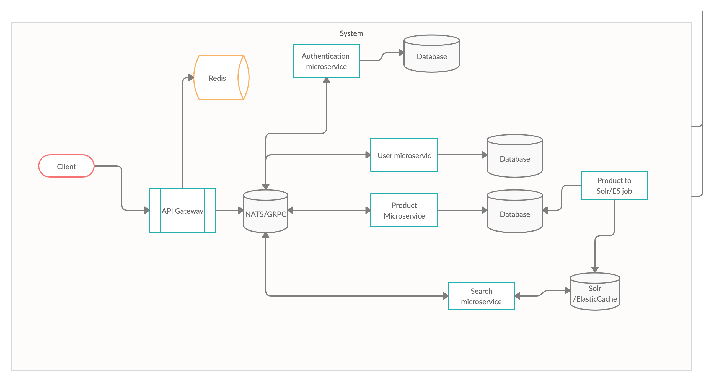

##Architecture Overview. 
Last modified: 30 March 2020 
Author: Vahan Nasibyan
Team: TBD 

##Summary  

Current system overall architecture overview.

Framework used for microservices  [Moleculer](https://moleculer.services/)

For more details please visit [Core concepts](https://moleculer.services/docs/0.14/concepts.html)

We have [database per service](https://microservices.io/patterns/data/database-per-service.html) and will use [Saga pattern](https://microservices.io/patterns/data/saga.html) and [event sourcing](https://microservices.io/patterns/data/event-sourcing.html) for data consistency and [CQRS](https://microservices.io/patterns/data/cqrs.html) for solving data queries.

We will use [ElasticSearch](https://www.elastic.co/elastic-stack) for Search functionality.

